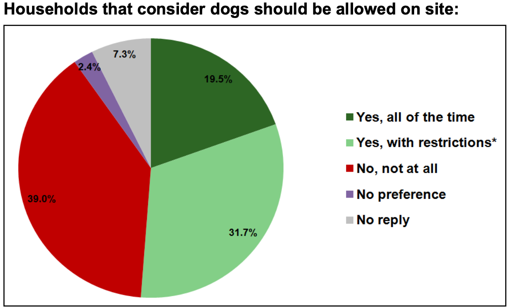

## Tilton Playing Field - Dog Risk

### Public Consultation on Dogs on the Playing Field

The Playing Field is developed and maintained in accordance with thee [Community Vision and Action Plan]().

This document was produced by the _RCC Community Action Team_ who we comissioned to engage widely in a community consultation process.

Views were acquired through a household survey, school visits, and open day and a village picnic.

This issue of dog use was covered in section 7.3, which follows, and that resulted in **Recommendation 14** that has been the basis of policy since 2015.

Section 7.3 is reproduced below.

#### 7.3 Access to the Site

77% of respondents to the survey indicated they strongly agreed that the site should be a space for the whole community. Many of these felt this should include dog walkers and their pets, with 50% of all respondents suggesting dogs should be allowed. Whilst a number of people had no clear preference, there was a strong representation of 40% from those wishing dogs being excluded from the site.

This split in opinion was echoed at the open event with comments regarding dogs being divided almost 50/50. A high number of people at the event indicated that if dogs were to be allowed then appropriate signage is displayed encouraging owners to clear up any fouling.

It is clear that a decision whether to allow dogs needs to be made and effectively communicated to everyone in the community. The main restrictions people wanted to see enforced if dogs were to be allowed were that they be kept on leads and are cleaned up after. In addition however a number of people suggested that dogs be allowed on the site only a certain times. A compromise of this nature may make the situation more acceptable to more people. As in all cases of dog access, the policy would need to be self policing and rely on public support.

> **RECOMMENDATION 14**
>
> A policy of restricted access be introduced for a trial period excluding dogs from the site
>
> - At weekends
> - During school holidays
> - Between 3pm and 8pm
> - During public events
>
> At other times, dogs may be exercised off their leads subject to being under control and having and fouling removed.

---

**Jay DYKES**
_Tilton Playing Field_
18/02/23
